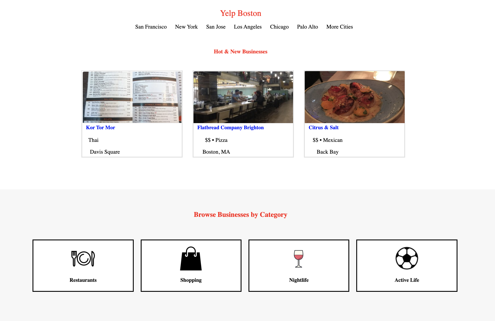

# Recreate Yelp Homepage

<i>Recreate the two pages of Yelp's Homepage using HTML and CSS</i>




<strong>How It's Made</strong>

This was one of my first projects when introduced to HTML, and CSS. The site is also responsive.
I began with making the wireframe for this project, by sectioning off the proper area that mimic my reference.
I used a font finder to find the most-similiar fonts relative to the real Yelp page for all my text.
I practiced my use of ```Float``` in CSS for this project. As well as creating margins and proper width percentages
when having multiple sections in an area when I wanted them to fit in a horizontal manner.
I used three separate Media Queries to make the site reponsive in mobile, tablet, and desktop mode.

<strong>Lessons Learned</strong>

Media queries allow for <i>a lot</i> accessability for users across a range of devices.
Previously I never gave much thought about the fact that the different interfaces for these devices
<i>do</i> need to need individually coded- and it's not just magic. I now start to look at every site I go to in this way- and 
each with a bit of new appreciation when seeing how well they translate in looks.
